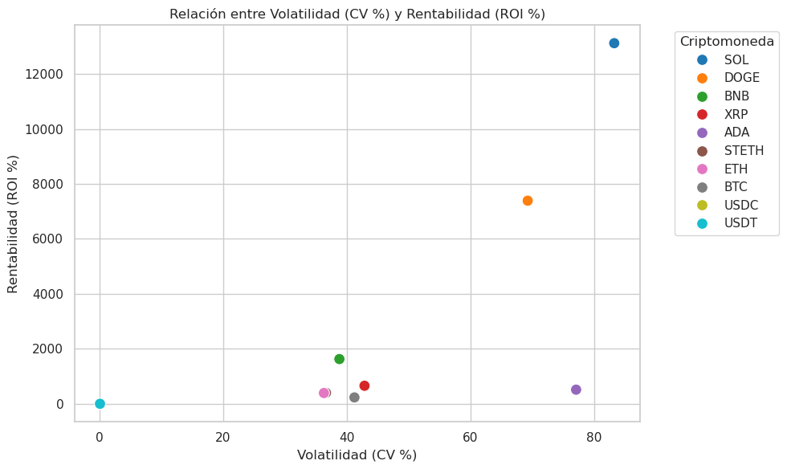
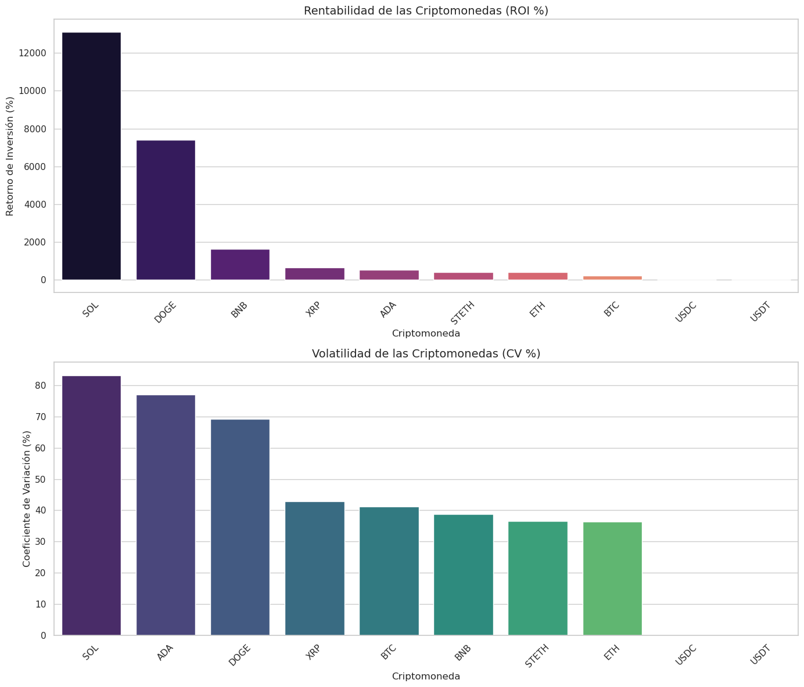
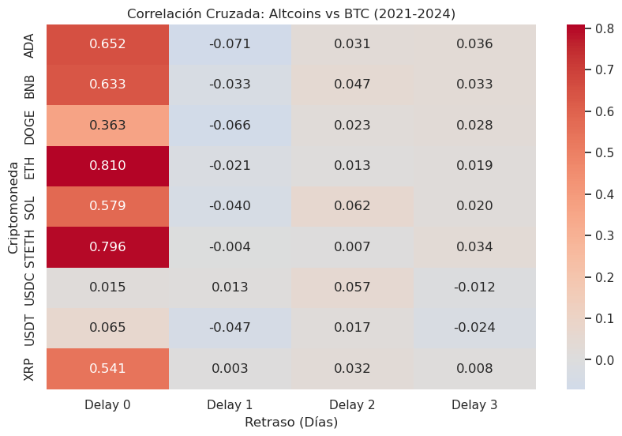
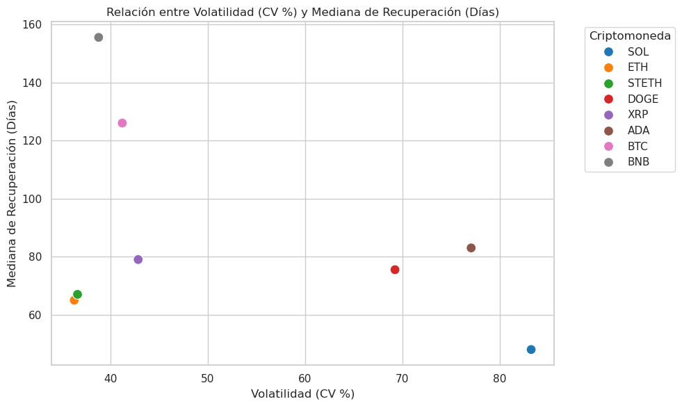
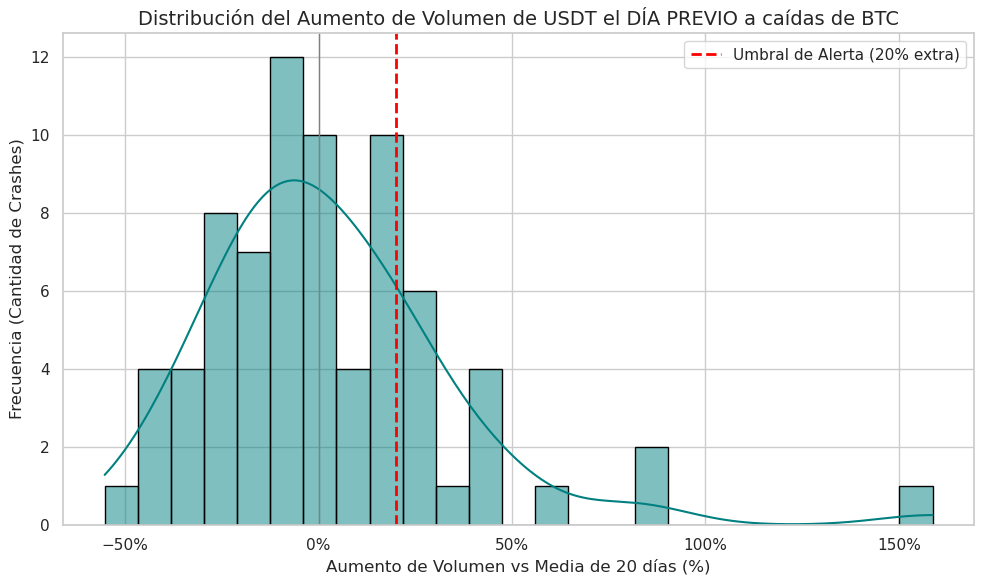
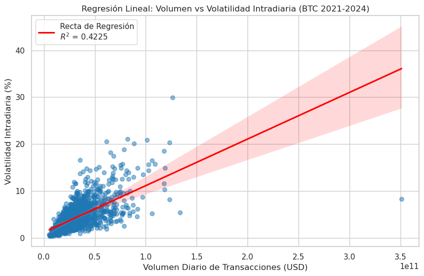
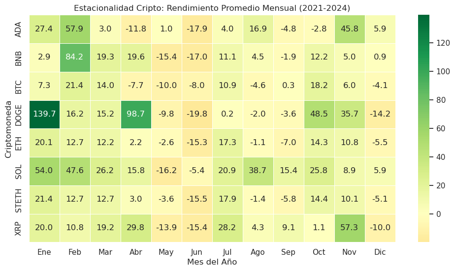

# Análisis Exploratorio y Rendimiento de Criptomonedas (2021-2024)
**Objetivo del Estudio**: El análisis evalúa el comportamiento de un portafolio de las principales criptomonedas desde el 1 de enero de 2021 hasta el 29 de noviembre de 2024. Se compararon métricas clave como el Retorno de Inversión (**ROI**), la **volatilidad** (Coeficiente de Variación o CV), la **resiliencia** ante caídas del mercado y la **estacionalidad**.

### Relación entre Rentabilidad (ROI) y Riesgo (CV)
El estudio confirma que en el mercado cripto se cumple la premisa financiera tradicional: a mayor **riesgo**, mayor es la **ganancia** potencial, mostrando una correlación matemática positiva de **0.66**.

Líderes de rentabilidad y volatilidad: Solana (SOL) y Dogecoin (DOGE) mostraron los retornos más excepcionales (**13,121%** y **7,390%** respectivamente). Sin embargo, también representaron el mayor nivel de riesgo y fluctuación extrema del portafolio.

El "Sweet Spot" Institucional: Bitcoin (BTC) y Ethereum (ETH) tuvieron **retornos** mucho más conservadores (231% y 392%), pero lograron compensarlo manteniéndose como los criptoactivos de menor **volatilidad**, agrupándose en una zona de riesgo controlado.

La Anomalía de Cardano: Cardano (ADA) presentó niveles de volatilidad altísimos (similares a SOL y DOGE), pero sus retornos se estancaron, lo que indica que el inversor asumió un **alto riesgo** sin la recompensa proporcional.

### El "Efecto Arrastre" de Bitcoin
Existe una creencia de que Bitcoin dirige al mercado, la cual fue validada, pero con una restricción temporal importante.

Impacto Inmediato: El arrastre hacia las altcoins ocurre de forma **inmediata** en una misma ventana de 24 horas (Delay 0). Ethereum (ETH) y STETH son los que siguen a Bitcoin con mayor fidelidad.

Mito del "Efecto Eco": En los días posteriores a un movimiento de **Bitcoin** (Delay 1, 2 y 3), las correlaciones caen drásticamente a cero. Esto desmiente que se pueda predecir y comprar altcoins al día siguiente de que Bitcoin suba.

Aislamiento de Memecoins: Dogecoin (DOGE) presenta la correlación más baja del grupo en el mismo día, evidenciando que se mueve por **especulación** y redes sociales, no por los fundamentales de Bitcoin.

### Resiliencia y Tiempos de Recuperación
Para medir la **resiliencia**, se analizó el tiempo de recuperación tras una caída drástica del precio del **15%** o más en una semana.

Efecto Rebote: Se detectó una **correlación inversa** (-0.43) entre la volatilidad y el tiempo de recuperación. Sorprendentemente, los activos más inestables tienden a recuperarse más rápido.

Agilidad vs Estabilidad: Solana (SOL) registró la mayor cantidad de caídas (129), pero es el activo que se recupera más velozmente, con una mediana de solo 48 días. Por su parte, Bitcoin (BTC) demostró ser el más resistente con solo 44 caídas, pero sus periodos de recuperación son extensos (mediana de 126 días) por estar vinculados a mercados bajistas **macroeconómicos**.

Binance Coin (BNB) destacó negativamente al poseer la recuperación más lenta del portafolio (155.5 días).

### Análisis Predictivo y Volumen Operativo
Se desmitificó el uso de volumen de stablecoins como una "**bola de cristal**" y se analizó la causa de la volatilidad intradiaria.

Falla de la Alerta en Stablecoins: La narrativa que indica que un salto en el **volumen transaccional** de Tether (USDT) precede un **crash** de Bitcoin resultó tener una efectividad de apenas un **23.38%**. Es decir, usar este indicador por sí solo es ineficiente y brinda un falso sentimiento de seguridad.

### Volumen vs. Volatilidad en Bitcoin 
Existe una **correlación positiva moderada** entre la cantidad de dinero operado y las fluctuaciones diarias de BTC. Aproximadamente el **42.25%** de la volatilidad intradiaria de Bitcoin se explica de manera exclusiva por el volumen transaccionado.

### Estacionalidad del Mercado
El comportamiento histórico por meses validó varias tendencias fuertemente arraigadas en la comunidad.

Trimestre Alcista: El primer trimestre (Q1), compuesto por enero, febrero y marzo, es históricamente muy **rentable**.

Depresión de Mitad de Año: Mayo y junio son inequívocamente los peores meses, donde la mayoría de los activos presentan rendimientos promedio **negativos**.

"Uptober": El mes de octubre hace honor a su reputación y actúa sistemáticamente como un punto de fuerte **recuperación alcista** que tiende a extenderse hasta noviembre. Diciembre funciona más como un periodo de consolidación o ligera **toma de ganancias**.
